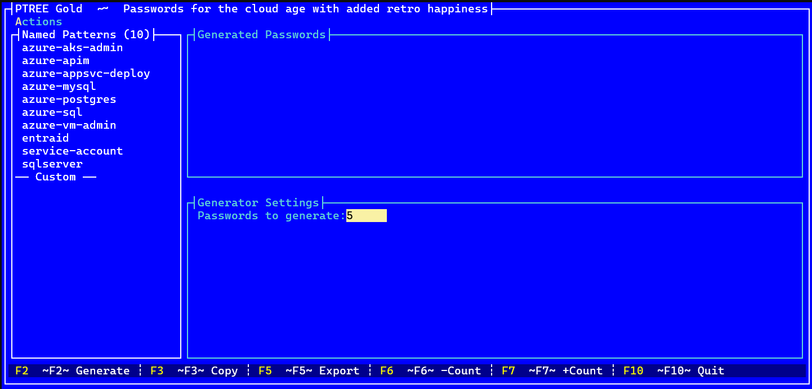
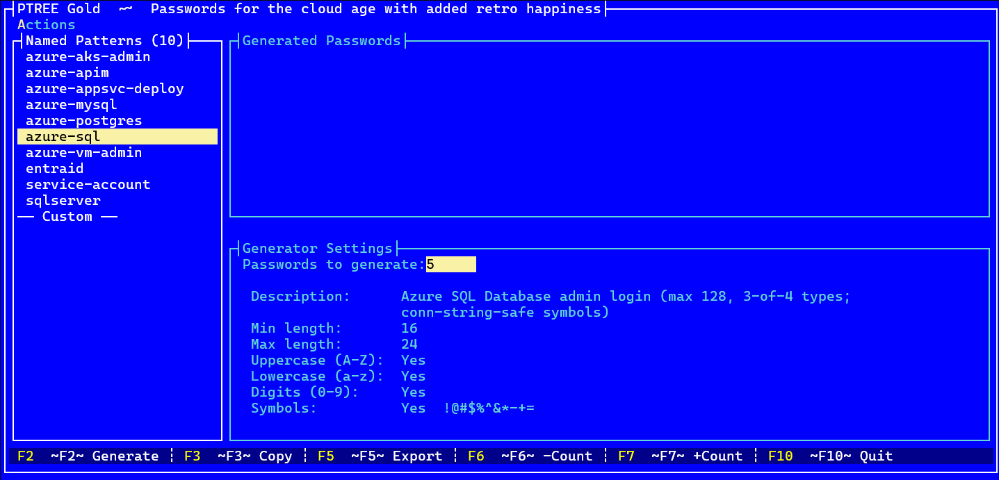
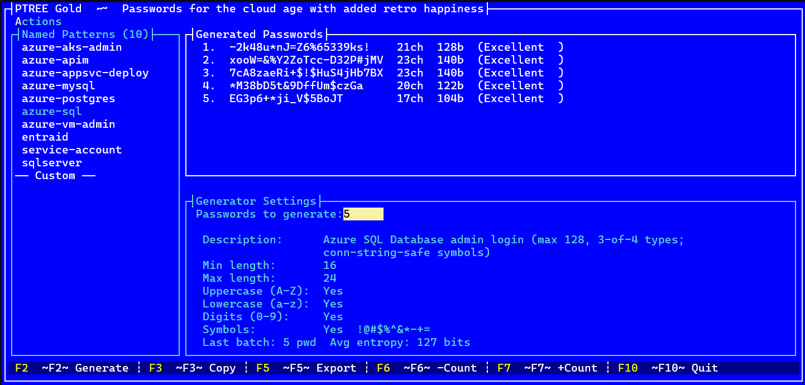
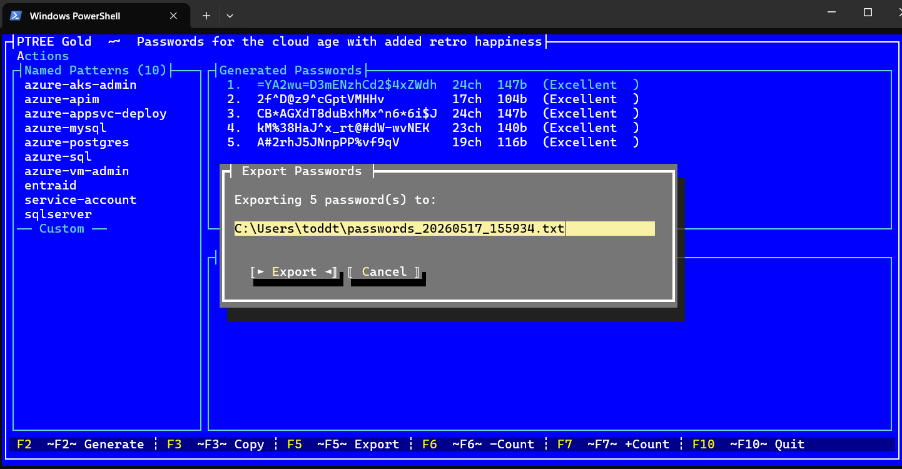
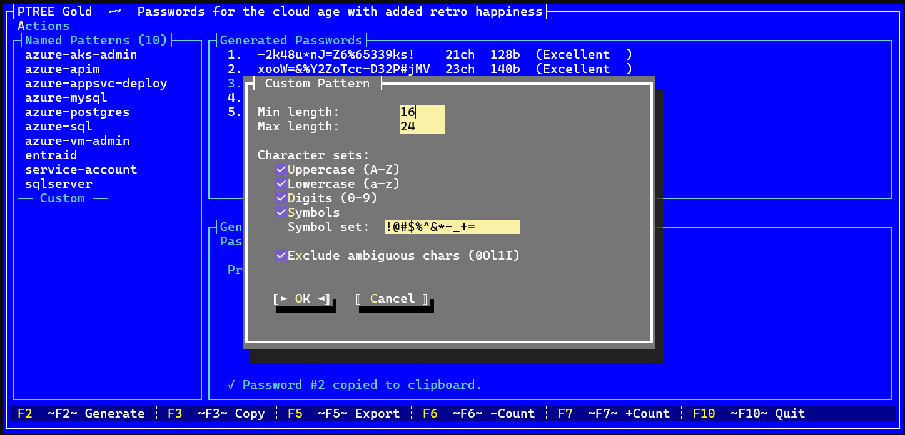

# 🌲 PTREE Gold — `ptg`

> *Passwords for the cloud age, with added retro happiness.*
**PTREE Gold** generates cryptographically strong passwords tailored for specific cloud and on-premises services. With a fast terminal-based UI inspired by the legendary DOS utilities of the 80's and 90's. No more blindly trusting random websites to generate secure passwords that match the pattern you need. PTree Gold does it all locally, securely and with retro charm.


## Key features:

- **Named patterns** — pre-built profiles for common Azure and Windows services (SQL Server, Entra ID, Azure SQL, MySQL, PostgreSQL, AKS, App Service, APIM, VM admins, and more)
- **Custom patterns** — build a one-off pattern on the fly without touching any config file
- **Entropy display** — every generated password shows its bit-strength and a label (Weak / Fair / Strong / Very Strong / Excellent)
- **Batch generation** — generate 1–50 passwords in one shot
- **Copy to clipboard** — hit `F3` to copy the selected password instantly
- **Export to file** — save the current batch to a plain-text file with `F5`
- **Ambiguous character exclusion** — optionally strip `0`, `O`, `l`, `1`, `I` from the pool so passwords survive being read aloud or typed off a screen

## Retro Inspiration

Long before Windows and GUI's were a thing, Text User Interfaces ruled the earth. Utilities like XTree Gold (1991, Executive Systems Inc.) and Norton Commander perfected the art of text based based tools that made navigating a hard drive *feel good*. The secret was its design philosophy: a minimal, keyboard-driven interface where every action had a single key, panels were always visible, and you always knew exactly where you were.

PTREE Gold borrows that same philosophy for password management:

---

## Screenshots

**Startup — pattern list on the left, empty password panel on the right:**



**Select a pattern to see its rules in the Generator Settings panel:**



**Press `Enter` or `F2` to generate — passwords with length and entropy score appear instantly:**



**Press `F5` to export the batch — the file path is pre-filled and editable:**



**Select `── Custom ──` and press `F2` to build a one-off pattern on the fly:**



---

## Download & Install

Pre-built self-contained binaries are published for every release on the [Releases page](https://github.com/toddwhitehead/ptreegold/releases). No .NET SDK required to run them.

### Windows — WinGet (recommended)

```powershell
winget install ToddWhitehead.PTreeGold
```

After installation, run from any terminal:

```powershell
ptg
```

### Windows (x64) — Manual

1. Download `ptg-vX.Y.Z-win-x64.zip` from the [latest release](https://github.com/toddwhitehead/ptreegold/releases/latest).
2. Extract the archive (right-click → **Extract All**, or `Expand-Archive` in PowerShell):
   ```powershell
   Expand-Archive ptg-vX.Y.Z-win-x64.zip -DestinationPath ptg
   ```
3. Enter the extracted folder and run:
   ```powershell
   cd ptg
   .\ptg.exe
   ```

### macOS (x64)

1. Download `ptg-vX.Y.Z-osx-x64.tar.gz` from the [latest release](https://github.com/toddwhitehead/ptreegold/releases/latest).
2. Extract the archive and make the binary executable:
   ```bash
   tar -xzf ptg-vX.Y.Z-osx-x64.tar.gz
   cd ptg
   chmod +x ptg
   ```
3. Run the app:
   ```bash
   ./ptg
   ```
   > **Note:** macOS may show a Gatekeeper warning the first time. To allow it, open **System Settings → Privacy & Security** and click **Allow Anyway**, or run `xattr -c ./ptg` before launching.

### Linux (x64)

1. Download `ptg-vX.Y.Z-linux-x64.tar.gz` from the [latest release](https://github.com/toddwhitehead/ptreegold/releases/latest).
2. Extract the archive and make the binary executable:
   ```bash
   tar -xzf ptg-vX.Y.Z-linux-x64.tar.gz
   cd ptg
   chmod +x ptg
   ```
3. Run the app:
   ```bash
   ./ptg
   ```

---


## Maintainers: MSIX publishing for Microsoft Store + WinGet

The release workflow now always produces a `ptg-vX.Y.Z-win-x64.msix` artifact and uploads it to GitHub Releases.
When signing secrets are configured, that MSIX is signed and can be published to WinGet.

Configure these GitHub repository secrets before cutting a release tag:

- `WINDOWS_STORE_IDENTITY_NAME` — Store package identity name
- `WINDOWS_STORE_PUBLISHER` — Store publisher subject (`CN=...`)
- `WINDOWS_STORE_CERTIFICATE_BASE64` — base64-encoded `.pfx` used to sign the MSIX
- `WINDOWS_STORE_CERTIFICATE_PASSWORD` — password for the `.pfx`
- `WINDOWS_STORE_DISPLAY_NAME` (optional) — app display name override
- `WINDOWS_STORE_PUBLISHER_DISPLAY_NAME` (optional) — publisher display name override
- `WINGET_TOKEN` — token used by `winget-releaser`

`WINDOWS_STORE_IDENTITY_NAME` and `WINDOWS_STORE_PUBLISHER` can also be set as repository variables instead of secrets.
If neither `WINDOWS_STORE_IDENTITY_NAME` nor `WINDOWS_STORE_PUBLISHER` is configured, unsigned artifact builds fall back to `PTreeGold.Unsigned` and `CN=Unsigned PTreeGold Build`.
`WINDOWS_STORE_IDENTITY_NAME` is the package identity embedded in the MSIX manifest and should be explicitly configured for official releases.
These fallback unsigned artifacts are intended for testing only and should not be used for official distribution channels (Store/WinGet).
Unsigned fallback artifacts may fail standard end-user installation trust checks and should not be treated as production installers.

If signing secrets are missing, the workflow still publishes an unsigned MSIX artifact and skips WinGet publish.

---

## Running It

```powershell
.\ptg.exe
```

Or build and run from the project root:

```powershell
dotnet run
```

**Keyboard shortcuts:**

| Key | Action |
|-----|--------|
| `↑` / `↓` | Navigate the pattern list |
| `Enter` or `F2` | Open the Generate dialog for the selected pattern |
| `F3` | Copy the highlighted password to clipboard |
| `F5` | Export the current batch to a file |
| `F6` / `F7` | Decrease / increase password count by 1 |
| `Tab` / `Shift+Tab` | Cycle focus between panels |
| `F10` | Quit |

---

## How Patterns Work

Patterns are stored as named entries in `appsettings.json` under the `"patterns"` key. Each pattern is a JSON object describing the rules the generator must satisfy:

```json
{
  "patterns": {
    "my-pattern": {
      "description": "Human-readable label shown in the UI",
      "minLength": 16,
      "maxLength": 24,
      "useUppercase": true,
      "useLowercase": true,
      "useDigits": true,
      "useSymbols": true,
      "symbolSet": "!@#$%^&*-_+=",
      "excludeAmbiguous": true,
      "minUppercase": 2,
      "minLowercase": 2,
      "minDigits": 2,
      "minSymbols": 1
    }
  }
}
```

### Field Reference

| Field | Type | Description |
|-------|------|-------------|
| `description` | string | Shown in the **Generator Settings** panel |
| `minLength` / `maxLength` | int | Final password length is chosen randomly in this range |
| `useUppercase` / `useLowercase` / `useDigits` / `useSymbols` | bool | Which character classes are included in the pool |
| `symbolSet` | string | Exact symbol characters to use (leave empty for default `!@#$%^&*-_+=`) |
| `excludeAmbiguous` | bool | Strip `0 O l 1 I` from all pools |
| `minUppercase` / `minLowercase` / `minDigits` / `minSymbols` | int | Guaranteed minimums — the generator always satisfies these before filling the rest randomly |

The generator picks required characters from each class first, then fills the remaining slots from the combined pool, then **cryptographically shuffles** the whole result — so the required characters never appear in predictable positions.

### Adding a New Pattern

1. Open `appsettings.json` in the project root.
2. Add a new key inside `"patterns"`. The key becomes the name shown in the left panel.
3. Fill in the fields — copy an existing pattern as a starting point.
4. Save and restart `ptg.exe`. Your pattern appears in the list immediately.

**Example — a pattern for a local Wi-Fi router admin page:**

```json
"home-router": {
  "description": "Home router admin (no special chars, long)",
  "minLength": 20,
  "maxLength": 28,
  "useUppercase": true,
  "useLowercase": true,
  "useDigits": true,
  "useSymbols": false,
  "symbolSet": "",
  "excludeAmbiguous": true,
  "minUppercase": 2,
  "minLowercase": 4,
  "minDigits": 2,
  "minSymbols": 0
}
```

No recompile needed — `appsettings.json` is copied to the output directory on every build and read at startup.

---

## Built-in Patterns

| Pattern key | Target service |
|-------------|---------------|
| `sqlserver` | On-premises SQL Server login |
| `entraid` | Microsoft Entra ID / Azure AD user account |
| `service-account` | Windows / Active Directory service account |
| `azure-sql` | Azure SQL Database admin login |
| `azure-mysql` | Azure Database for MySQL Flexible Server |
| `azure-postgres` | Azure Database for PostgreSQL Flexible Server |
| `azure-vm-admin` | Azure VM Windows local administrator |
| `azure-aks-admin` | Azure Kubernetes Service Windows node admin |
| `azure-appsvc-deploy` | Azure App Service FTP / deployment credentials |
| `azure-apim` | Azure API Management publisher / admin account |

---

## Project Structure

```
ptg/
├── appsettings.json        ← patterns live here
├── Program.cs              ← entry point, wires services + launches UI
├── Models/
│   ├── AppSettings.cs      ← deserialization model
│   └── PasswordPattern.cs  ← pattern definition
├── Services/
│   ├── ConfigService.cs    ← loads appsettings.json
│   ├── PasswordGenerator.cs← crypto-random generation engine
│   ├── EntropyCalculator.cs← bits of entropy + strength labels
│   └── ExportService.cs    ← file export
└── UI/
    ├── MainWindow.cs       ← main layout (pattern list + password list)
    ├── MainMenu.cs         ← menu bar definition
    ├── GenerateDialog.cs   ← F2 generate modal
    ├── GenerateFlow.cs     ← orchestrates generate + custom pattern flow
    ├── DisplayHelpers.cs   ← formatting utilities
    └── AppColorScheme.cs   ← retro colour palette
```

---

## Requirements

- [.NET 9 SDK](https://dotnet.microsoft.com/download/dotnet/9.0)
- Windows, macOS, or Linux terminal

---

## License

See [LICENSE](LICENSE).
